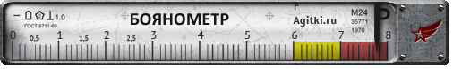

# postman-boyan-checker



Простейший микросервис задача которого является учет добавленных изображений, в частности 
проверка дубликатов ("боянов"). Алгоритм работы заключается в следующем:  

 - Загрузка изображения по заданному `image_url`,
 - Подсчет некого хеша по полученному изображению,
 - Поиск хеша по уже сохранненым, с учетом допустимой ошибки

Есть несколько вопросов:

- Как вычислять хеши основанные на "похожести"? 
- Как производить поиск по полученным хешам?

### Как вычислять хеши "похожести"?

Криптографические хеши — основанны на лавинном эффекте: изменение одного бита исходных
 данных влечет за собой изменение всего хеша радикальным образом.

Perceptive Hash — основаны наоборот на "близости" исходных данных, т.е. похожие данные 
будут иметь похожие хеши.

Существует несколько реализаций для получения perceptive hash, например [blockhash](http://blockhash.io/) и [pHash](http://www.phash.org/).
На тестовых данных pHash вел себя лучше.

### Как производить поиск по полученным хешам? 

Для поиска похожих хешей можно вычислять количество отличающихся битов в хеше.
Для этого существует алгоритм [hamming distance](https://en.wikipedia.org/wiki/Hamming_distance).

Однако возникает вопрос, как искать по базе по похожим хешам. Данную проблему 
решает библиотека hmsearch. Принцип ее работы описан
в [этой статье](http://commonsmachinery.se/2014/09/digital-image-matching-part-2-finding-similar-hashes/).

## API

Сервис доступен по HTTP, и может обрабатывать два запроса:

### Lookup

Запрос: 
```
GET /lookup?image_url=<image_url> HTTP/1.1
```
где `<image_url>` — URL изображения для проверки.

Ответ при успешном выполнении: 
```json
{ 
  "image_hash": "ba3dcfabbc004800", 
  "lookup_result": 
  [{
    "image_hash": "ba1dc8ab5da05800",
    "distance": 0.171875
  }]
}
```

Где:
 - `.image_hash` — это хеш изображения по заданному URL,
 - `.lookup_result[]` — содержит список найденных совпадений в БД,
   - `.image_hash` — хеш совпадения
   - `.distance` — нормализированный hamming distance (0 — полное совпадение)

### Insert

Запрос: 
```
POST /insert?image_url=<image_url> HTTP/1.1
```
где `<image_url>` — URL изображения для вставки.

Ответ при успешном выполнении: 
```json
{ 
  "image_hash": "ba3dcfabbc004800"
}
```

Где:
 - `.image_hash` — это хеш данного изображения. 

## Деплой

Для деплоя используется Docker.

Для сборки образа необходимо выполнить:

```bash
docker build -t knord/postman-boyan-checker .
```

Для запуска образа на Docker необходимо выполнить:

```bash
docker run -v /data:/data -p 3000:3000 -it knord/postman-boyan-checker
```

Сервис пишет данные в базу данных по пути "/data/hashes.kch", поэтому для сохранения
данных нужно подключать volume с внешнего хоста. 
Сервис выставляет порт 3000 для обработки внешних подключений.
